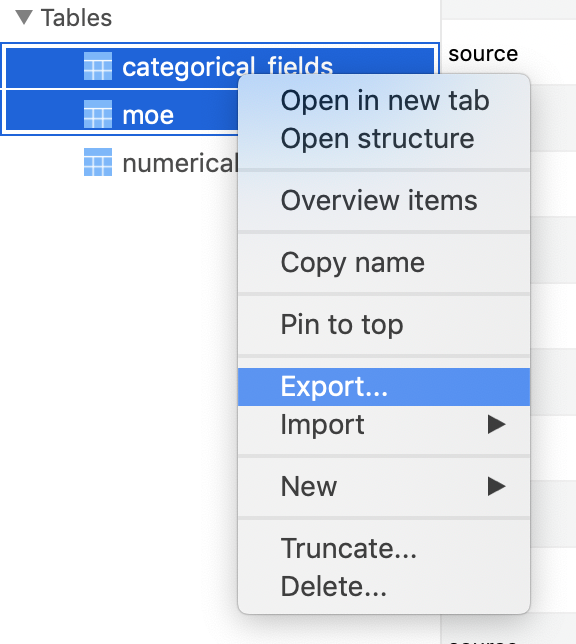

# Secondary Structure Interaction Visualizer

[](https://travis-ci.com/omwan/hbonds-web)

Web server to generate scatter plots for secondary structure interaction data from the RCSB Protein Data Bank

## Installation (Local)

These instructions assume development will occur on MacOS. For Linux, the instructions are more or less the same; see the remote installation steps for any minor differences (such as installing dependencies with apt-get instead of brew, and running the postgres command line from the postgres user instead of postgres sql). This has not been tested for Windows.

Ensure that Python 3 and at least version 19 of pip are installed on the computer/server where the app will be running. This can be verified with `python3 --version` and `pip3 —version`. Homebrew is also helpful to have, and can be installed by following the instructions [here](<https://brew.sh/>).

Clone the repository with `git clone https://github.com/omwan/hbonds-web.git`

### Database setup

Install PostgreSQL (the remote database used for this application) with `brew install postgres`. It may also be necessary to start the server with `pg_ctl -D /usr/local/var/postgres start`.

Create a user for the application called ssi with `createuser -d ssi` and then set a password for the user. This can be done by installing pwgen on to your computer with `brew install pwgen` and then running `pwgen 12 1` to generate a random password. Set the password by running the following commands:

```bash
psql postgres
alter user ssi with password '<password>';
```

Make sure to save the password locally somewhere so you can reference it later. Exit the psql terminal with Ctrl+D.

Create the database for the application by running `createdb ssi_dev`. 

#### Populating the database from the table dump

A table dump of the dataset is available in a [Google Drive](https://drive.google.com/drive/folders/1i6lGQtuf3ar6ck7K705mwEHzzTkrv-JR?usp=sharing) folder as `tables_dump_February_27_2019.sql`. To import the full dataset from the SQL dump, run the following commands: 

```
psql postgres
\c ssi_dev
\i <full path to table dump file>
```

There is a significant amount of data in this dump, so it will take a while. Note that this table dump also includes the `categorical_fields` table mentioned below, so that step does not need to be followed if using the table dump.

#### Populating the database from a CSV file

To insert custom data into the database from a CSV file, there are a couple of steps to follow:

* Any data that came through as "NA" rather than a number needs to be removed. Use any text editor such as Sublime or Atom to do a find+replace on "NA" and replace with a blank string. This will then be converted to null values in the database.
* Set the name of the first column (with the row number) to "id"
* I used [TablePlus](<https://tableplus.io/>) to insert the data into the database since it has a very easy to use interface for importing CSVs. Data can also be imported from a CSV file via the command line with the following instructions: <http://www.postgresqltutorial.com/import-csv-file-into-posgresql-table/>

Create a new connection in TablePlus (Connection > New) with the following configurations:

* Host/Socket: localhost
* User: ssi
* Password: the password saved earlier
* Port: 5432
* Database: ssi_dev

Confirm that the connection works by clicking "Test", then click save to save the connection information. Connect to the database by double clicking on the connection. 

Right click on "Tables" in the left-hand sidebar and select Import > From CSV. Make sure the "Create new table" option is checked. A preview of the table can be seen, verify that the columns are coming through correctly. Corrections I made:

* Set the data type for the "id" column to int4
* Do not import the "X" column

Once everything looks good in the preview window, click "Import" to create the database table. It may be helpful to test the configurations on a subset of the CSV file first, such as the first 100 rows. When importing the full CSV file, it will take several minutes as there is a significant amount of data.

Lastly, create the table "categorical fields" containing the data for the dropdown menus. The table dump for this file is available in the `sql` folder of this repository. To create the table + populate the database, run the following commands:

```
psql postgres
\c ssi_dev
\i <full path to sql/categorical_fields.sql in repository>
```

#### Index Creation

This step is optional, but makes the queries significantly faster by creating indexes. The file containing the indexes is available in the `sql` folder of this repository. Run the index file with the following commands:

```
psql postgres
\c ssi_dev
\i <full path to sql/ssi_indexes.sql in repository>
```

### Application setup

In the terminal, cd into the folder for the repository. Install venv to create a virtual environment with `pip3 install venv`, and create an environment for the project with `virtualenv venv`.

Run `source venv/bin/activate` to activate the newly created environment.

Install dependencies for the project with `pip3 install -r requirements.txt.`

Set an environment variable with the database credentials:

```
export DATABASE_URL=postgres://ssi:<password>@localhost:5432/ssi_dev
```

(This can be streamlined by creating a filed named `.env` containing that command, and then running `source .env` before running the application. The file is ignored by git, so anything written to the file will not be published to the web.)

Open the file `ssi/config.py` in the repository and set the filepaths in the `DevelopmentConfig` class with locations for your own computer. `UPLOAD_FOLDER` can be any folder on your computer, it will be where any files uploaded to or generated by the app will be written. `MOE_FOLDER` should point to the location of the `moe` folder within the repository. 

To run the application, run `FLASK_ENV=production FLASK_APP=ssi/app.py python3 -m flask run`.

## Installation and Deployment (Remote)

This assumes that the application is running on a remote Linux server, specifically Ubuntu 18.04 x64. This has not been tested for Windows.

Ensure that Python 3 and at least version 19 of pip are installed on the computer/server where the app will be running. This can be verified with `python3 --version` and `pip3 —version`. This also expects nginx to be running on the server.

Note that this application is not configured with Flask for production, and is currently running in development mode on the remote server.

### User creation

Install pwgen onto the server with `sudo apt-get install pwgen` and then run `pwgen 12 1` to generate a password.

While in sudo mode, create a new user on the server for this application with `adduser ssi`. Set the password to the one generated above, and set the full name of the user to "SSI Application" or some other value you will remember; the other fields can be left blank.

Exit sudo mode and then sudo into the newly created user with `sudo su - ssi`. Clone the repository with `git clone https://github.com/omwan/hbonds-web.git`.

### Database setup

Install PostgreSQL (the relational database used for this application) with these instructions: [DigitalOcean](<https://www.digitalocean.com/community/tutorials/how-to-install-and-use-postgresql-on-ubuntu-18-04>). 

Sudo into the postgres user with `sudo su - postgres`.

Create a user called for the application called ssi with `createuser -d ssi` and then set a password for the user. This can be done by running `pwgen 12 1` to generate a random password. Set the password by entering the following commands:

```bash
psql
alter user ssi with password '<password>'
```

Make sure to save the password locally somewhere so you can reference it later. Exit the psql terminal with Ctrl+D. Exit the psql terminal with Ctrl+D.

Create the database for the application by running `createdb ssi_dev`. 

Get the database dump from your local environment by selecting all tables and then right click > Export, and select "SQL".



Get the file onto the remote server with scp

```
scp <filepath of table dump on local computer> <user>@<remote server>:<filepath on remote server where it should be uploaded>
```

For example: 

```
scp /Users/olivia/Documents/table_dump.sql user@domain.com:/home/ssi/
```

As the postgres user, run the following commands to insert the data from the table dump + create the indexes.

```
psql
\c ssi_prod
\i <path to table dump file>
\i <path to index file>
```

### Application setup

#### Nginx configuration

Edit the nginx config file ` ssi.ovmwan.com  ` in the repository to fit the domain that the app will be deployed to.

As the sudo user, copy the file to the nginx sites-available directory `/etc/nginx/sites-available`. Create a symlink to the sites-enabled directory with `ln -s /etc/nginx/sites-available/ssi.ovmwan.com /etc/nignx-sites-enabled`. Restart nginx and confirm that a 502 error is seen at the domain for the application (indicating that nginx is expecting an app to be runnning at that domain).

#### Running the app

Navigate back to the project directory as the ssi user. Set up virtualenv and install dependencies the same way as above.

Create a file `.env` with the database credentials:

```
export DATABASE_URL=postgres://ssi:<password>@localhost:5432/ssi_prod
```

Run the start script with `./start.sh` (it may be necessary to change permissions on the script with `chmod u+x start.sh`). The app should now be running at the domain name of the app configured with nginx earlier.

#### Creating a systemd service

To run the application in the background upon server startup rather than having to manually run the `start.sh` script every time, a systemd service can be created. 

As the sudo user, copy the `ssi.service` file in the repository to `etc/systemd/system/`. Ensure that the app is not currently running, and then run `service ssi start`. You can run `service ssi status` to check that the app is running. 
